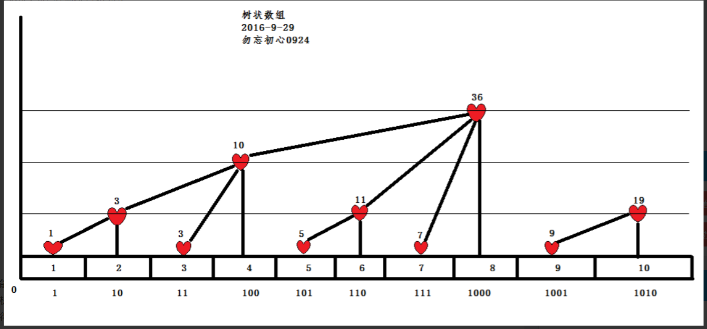

## 为什么要用树状数组

注意到j+最后一个1所代表的数时==父亲节点所在的值

1+1=10

10+10=100

11+1=100

如果想得到 [1...k]的前缀和

原理介绍（最好）：[树状数组 - 维基百科，自由的百科全书 (wikipedia.org)](https://zh.wikipedia.org/wiki/%E6%A0%91%E7%8A%B6%E6%95%B0%E7%BB%84)

基础：洛谷P3374

[P3374 【模板】树状数组 1 - 洛谷 | 计算机科学教育新生态 (luogu.com.cn)](https://www.luogu.com.cn/problem/P3374)

树状数组的应用：

##### 带有单点更新和区间修改的前缀和 370

[P3368 【模板】树状数组 2 - 洛谷 | 计算机科学教育新生态 (luogu.com.cn)](https://www.luogu.com.cn/problem/P3368)

[P3372 【模板】线段树 1 - 洛谷 | 计算机科学教育新生态 (luogu.com.cn)](https://www.luogu.com.cn/problem/P3372)

##### 逆序数+树状数组

[(77条消息) P1908 逆序对_我也啥也不会的博客-CSDN博客](https://blog.csdn.net/m0_63816423/article/details/123233623)

树状数组在信息学竞赛中的应用

[(77条消息) 树状数组应用汇总（全）_Guess_Ha的博客-CSDN博客_树状数组经典应用](https://blog.csdn.net/qq_39553725/article/details/76696168)
